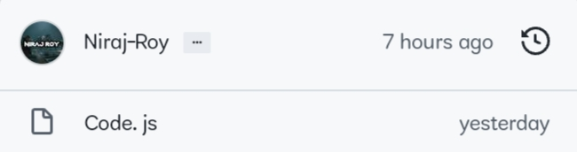
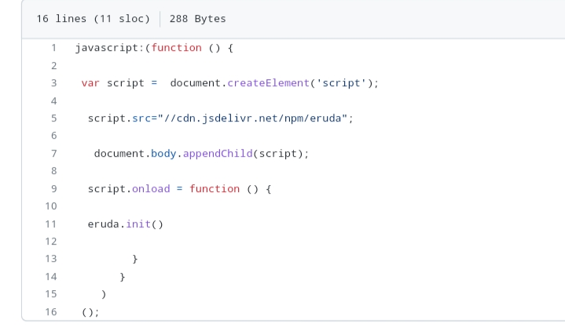
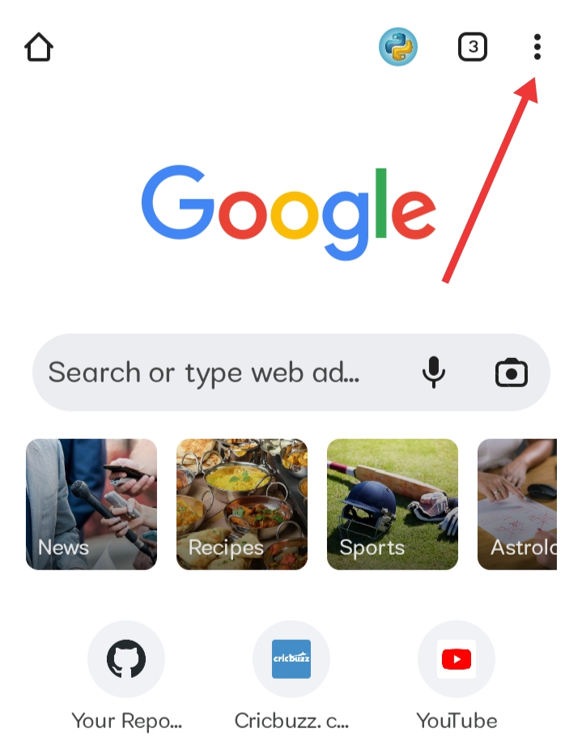
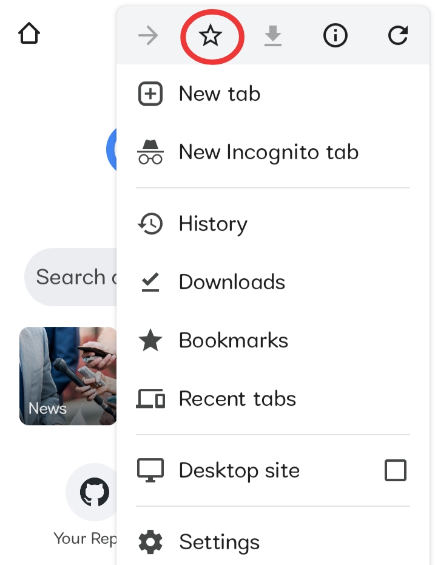
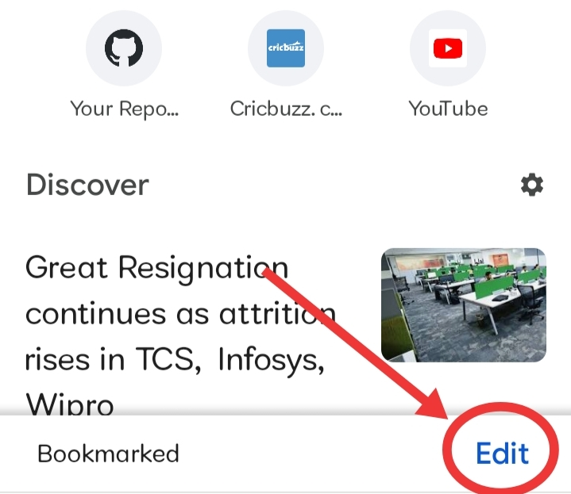
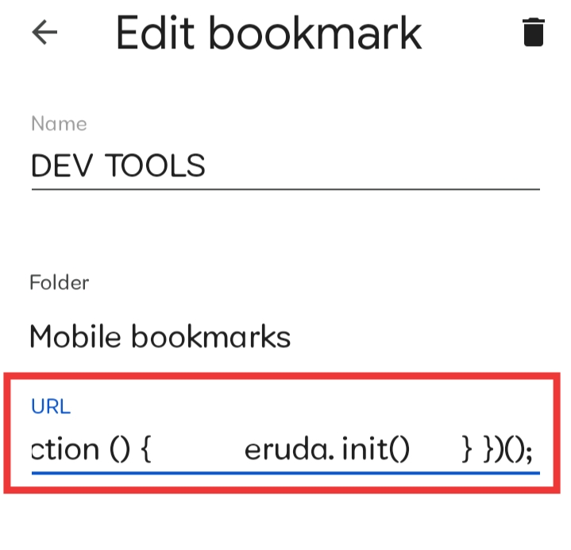
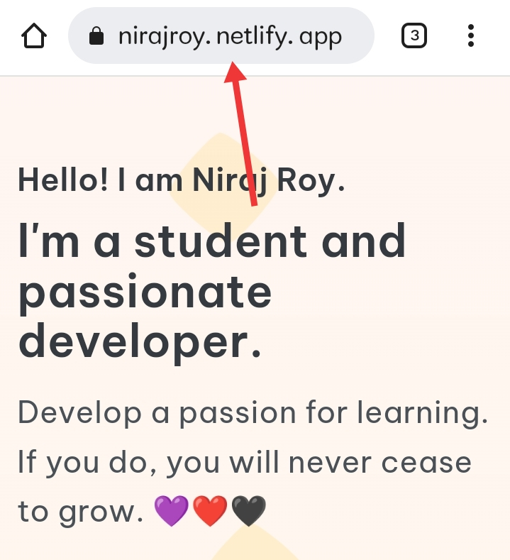
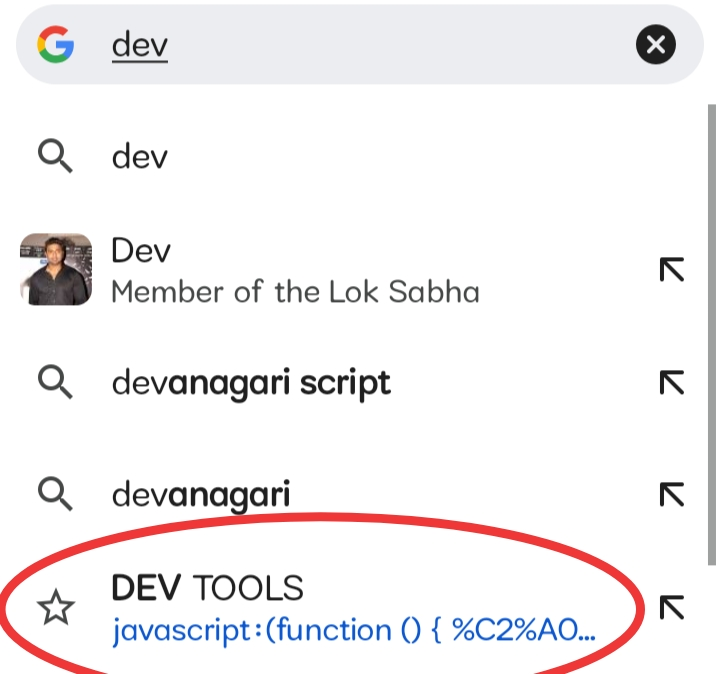
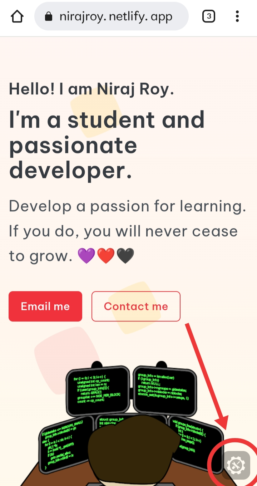
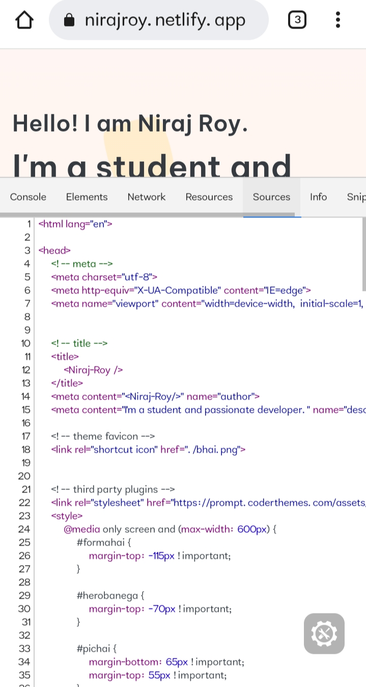

# Enable-Dev-Tools-in-Android

<h3 align="center"> U must have seen Dev Tools used by laptop or pc users ,
which help them to watch or edit the source code of the webpage or website... 

so , if you are a coding geek then this trick will help u to 
enable Dev Tools on your Android :) </h3>

<h2> The steps are very simple : </h2> 

     Go to Code.js file

    Copy the code there 

     
    
     Go to ur chrome browser home page & Click on three dots 
     

     
      Click on Star { bookmark }

     
      Click on 'Edit bookmark'

      Paste the code there With name " Dev Tools "

      Now go to any website & Click on search bar

       write Dev tools there 

      U will see Dev tools bookmark in suggestions 
 

     
    Click on it , A small tool will appear in the corner

      Press it & U will see the Dev Tools
 

    
           <Happy Coding ❤️\>
    
